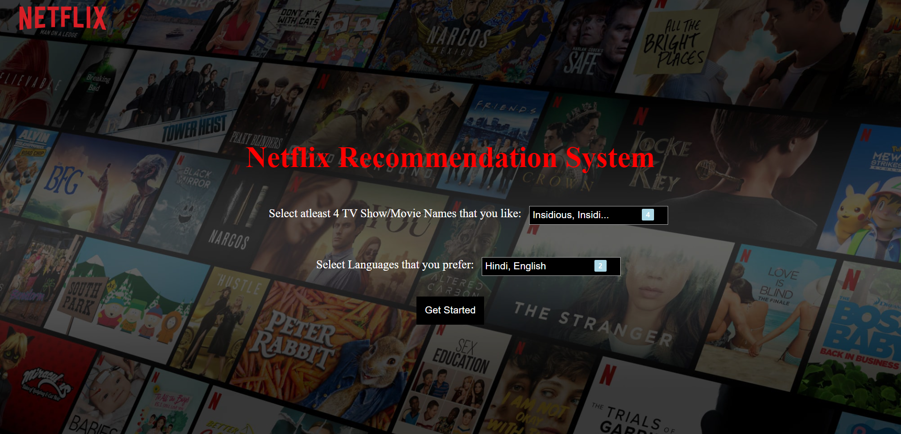

<h1 align="center">Netflix Engine</h1>

Netflix Engine is a web application used to recommend movies\shows depending on your 4 choices of your favourite selections and preferred language.
<strong>Python</strong> and <strong>Flask</strong> for backend and <strong>HTML</strong>, <strong>CSS</strong> and <strong>JavaScript</strong> for frontend.

## 📸 Screenshots

| Page                   | Preview |
|------------------------|---------|
| **Home Page**          |  |
| **Recommendation Page**|  |
| **Movie Details**      |  |
| **Netflix Page**       |  |

 # Netflix Engine app contains 4 main pages:
- [Home Page](#home-page)
- [Recommendation Page](#recommendation-page)
- [Movie Detail Page](#movie-detail-page)
- [Netflix Page](#netflix-page)

## Home Page
The user will give the engine 4 inputs of their favourite Movie\Show and their preferred language, Then Click on the Get Started button to see the list of recommendations.

## Recommendation Page
The user will get reccomendations for movie\show sorted based upon their IMDb Scores.

## Movie Detail Page
Click on your recommended movie\show and you will getall details like Genre, Movie Summary, Languages in which movie is available, IMDb scores, Directors, Writers and Actors and a direct link for the official Netflix movie\show 

## Netflix Page
Now you can login into your Netflix account and enjoy watching your selected movie\show from the recommendations.

## How to use
- [First open jupyter notebook terminal]
- [Second install Flask : pip install flask]
- [Third set the app directory to path (depending on where you downloaded the project file from github) : cd C:\Users\20115\Netflix-Engine\app]
- [Fourth Run the Netflix Engine React app using these 2 commands : >>FLASK_APP=app.py >>flask run]
